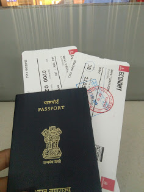
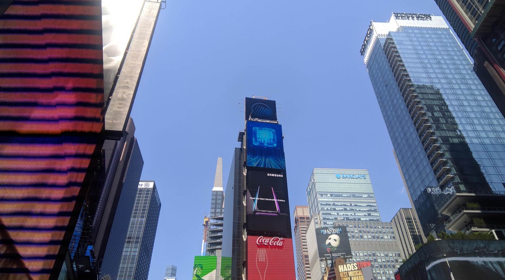
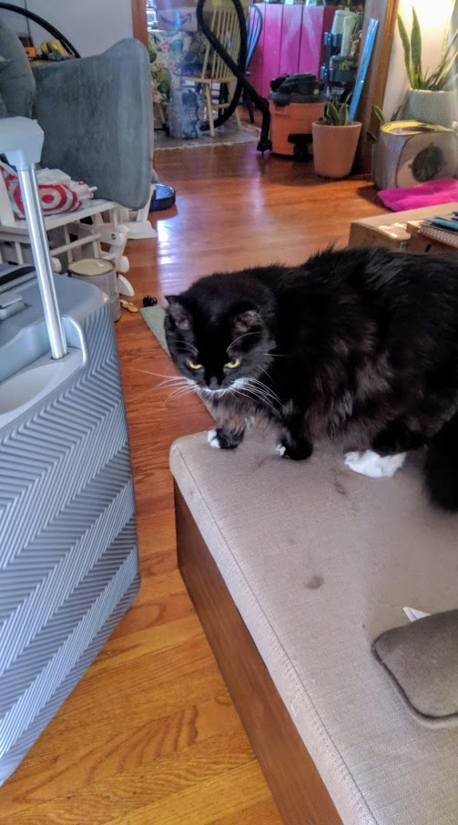

I was sitting in my office of **Siemens** in Bengaluru where I was a Software Intern and was working at the maximum capacity to complete the task. I don't particularly remember, but I think it was Drew's message on `poliastro` chatroom about the beginning of registrations for **Python in Astronomy 2019** and I thought that its a good chance to see the bigger picture, and hence I applied.

I think after almost 2 months, I got a mail from **Python in Astronomy SOC** saying :

> We are pleased to inform you that we are now able to offer you a place at the Python in Astronomy conference to be held at the Space Telescope Science Institute in Baltimore from 29th July - 2nd August 2019. A unique blend of talks, sprints and unconference sessions, accompanied by an interesting and diverse group of participants awaits you!

And I still remember, I was coming back from a lab with my friends from South Campus of IIT Mandi to where my hostel was (North Campus). On our way back, we decided to have dinner in a nearby restaurant where I got this email. This was the first time I was going to travel to the States and be a part of something which involves people who mentored me, people whom I follow on GitHub and people whom I look upto!

So, basically, the bottleneck of me attending PyAstro'19 was U.S. Visa. I did not have one, and getting one is both difficult and time consuming. I quickly applied for the Visa process, got the dates just 13 days prior to my flight bookings. It was very difficult. Apparently, the Visa interview was too awesome and I got the B1/B2 Visa and was ready to travel to the States for the first time in my life, and that too alone.

I booked **Emirates** , and I have to agree that they were too amazing after all the low cost carriers I flew in India. I flew Airbus A380 for the first time in my life and god, that was amazing! I was amazed to see how big an air-plane can be, how it was engineered. 

Moving forward, I reached the city of capitalists, the city full of power, the city where millionaires and billionaires are made, The New York City. I landed at the John F. Kennedy International Airport, many won't believe but the immigration process took just 15 minutes, and then I was free! Free to roam around in the oldest democracy of the world. 

I met a person whom I look upto every time I think about what I am going to do in life, **Juan Luis Cano Rodríguez** (www.juanlu.space) . We went to Baltimore on a bus! And I checked into the most amazing Airbnb stay I ever had anywhere. 

My hosts were a couple, staying with their two cats in a very beautiful house in Baltimore. I could become friends with one of them named "JayJay". The cat was sweet and very lazy. 

### The purpose of the visit, PyAstro 2019

Space Telescope Science Institute (STScI) was located around 2.5 kms from where I was living. The building was huge, but did not really seem like a place which operates Hubble, future JWST and many other space telescopes from the outside. But once you are inside, you understand what it means :) 

The whole time I spent here was amazing and will document it in another blog post. 

### Second Home, return trip via Princeton

While returning back home, I decided to visit my uncle who came to USA and settled here 20 years ago. I met, my brother for the first time in my life.

We went to a tour of the Princeton University, and even visited the old house of **Prof. Albert Einstein**. It was fun, I could actually eat proper Indian food after 7 long days.

### Extra Learning, and some thoughts

I learned a lot and experienced the cultural differences in India and US. I understood why people outside India feel Indians are not "well-mannered". This belief, is right and wrong at the same time. For people in the west, what manners mean, is completely different than I was taught since childhood. For us, its obeying our elders, touching their feet etc. For them, it doesn't matter if you touch someone's feet, rather what matters is smiling at every person who passes by.  People have to understand the difference, both are correct at their level. 

> You can't say someone is ill-mannered and expect them  to be on same page as yours when you are reading two different books and in this case, even two different genres. 

### So, should we not learn anything from the US? And hide behind the fact that we are reading two different books? 

The answer to this will be a big **NO**!

We have to learn a lot from them. Now, I already know what most of you are gonna think. US is a capitalist country, our ideologies don't match. But we already picked some really good things from their constitution while building one for us.

1. Impeachment of the president

2. Functions of president and vice-president

3. Removal of Supreme Court and High court judges

4. Fundamental Rights

5. Judicial review

6. Independence of judiciary

7. Preamble of the constitution

What is the one thing everyone knows about the constitution? Yes, the **Preamble** and the **Section with all the fundamental rights** . We took that from US. If we can do it then, why not do it now?

### What to learn then?

I was just crossing a street and noticed that a car is coming. I stopped right there (You know the standard India thing?). I did not want to die in a road accident in a foreign country. Just like [some of the foreigners did in India](https://www.indiatoday.in/india/story/road-accident-rajasthan-tourists-injured-1110798-2017-12-16). But I was surprised! The car stopped right there, the driver opened the window and politely said, "Sir, please go ahead!". I won't lie, but I really got emotional. I never got such a respect as a pedestrian in India. 

There was no place I could find which was dirty. Our Prime Minister has to step up and tell everybody to put their waste in dustbin. To a person in US, it seems like I don't know a thing from 1950s / 1960s? We are having that here in 2019. Isn't that a little bit shameful? And still I see my fellow students, who proudly call themselves IITians throw the waste anywhere they go. 

**Respecting Others** is a very good part of the culture in US. Yes, they do have discrimination, they do have some problems of their own, but whatever they may be, the way most of the people in US treat others is million times better than India. There was no point in my whole journey where someone tried to scam me, or someone tried to bully me or someone made fun of me. People were wearing what they wanted to wear. People were doing what they wanted to do. 

