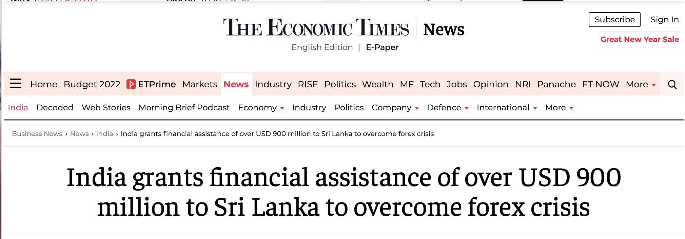

Did you see this news?

The tourism industry is in shatters. With different nations having different quarantine mandates, COVID19 cases peaking in some countries, and varying vaccination requirements, it is next to impossible to travel currently.

Adding to this mess, I am glad to share that we have set an example for our future generations. We have demonstrated how selfish and how illogical one can become. We have shown that the world indeed is not a family and how "Vasudhaiva Kutumbakam" is nothing but a gimmick.

New "variants" or as WHO puts it, ["variants of interest"](https://www.who.int/en/activities/tracking-SARS-CoV-2-variants/) keep popping up across the globe. And we are doing nothing to stop it. The only way through which we can stop the virus from mutating is to vaccinate the whole population and then start living a normal life.

Look at the map below. The following map shows the number of COVID-19 vaccination doses administered per 100 people within a given population. Can you spot something odd? Can you find a continent with an anomaly?

<iframe src="https://ourworldindata.org/grapher/covid-vaccination-doses-per-capita?tab=map&time=latest" loading="lazy" style="width: 100%; height: 600px; border: 0px none;"></iframe>

## Gross Inequality with Vaccination

I will go as far as saying that I am ashamed of what we have become. We can't think rationally. We can spend thousands of dollars in making sure no one can enter our borders without necessary COVID checks and vaccination mandates at risk of the tourism industry, but we can not spend the same money in helping poor countries with vaccination.  

The whole African Continent has fewer people than India/China. They would need a total of 250 Crore (2.5 Billion) vaccines to vaccinate them with both doses.  At the same time, [rich countries are throwing away millions of vaccines](https://www.nbcnews.com/news/us-news/america-has-wasted-least-15-million-covid-vaccine-doses-march-n1278211).

We are doing rather poorly on the vaccine donation front. [Covax is a great idea but is not meeting its targets](https://time.com/6096172/covax-vaccines-what-went-wrong/). And countries who can donate to Covax don't seem like they are doing the job. Look at this chart:

<iframe src="https://ourworldindata.org/grapher/covax-donations?country=FRA~ESP~SWE~USA~CAN~NOR~NZL~GBR~DNK~CHE~ITA~DEU~PRT~ARE~BEL~European+Union~JPN~NLD~FIN~HKG~IRL" loading="lazy" style="width: 100%; height: 600px; border: 0px none;"></iframe>

India at the same time, has donated to Covax and also done some direct donations to countries (which I feel more countries should adopt). So far we have donated 50 Million doses. We only need 50 such donations and we can cover 2.5 Billion doses. But the rich part of the world doesn't seem to understand this. India should also resume its supplies to Covax, or if Covax feels like a bureaucratic process, pick a nation and make sure it gets to 80-90% adult vaccinations.

## Why do all this?

**We don't end this fight until everyone is vaccinated. As simple as that!**

## What is wrong with tourism?

Recently, Sri Lanka's forex reserves depleted. They did not have the money to purchase oil for their energy requirements. While we don't face this issue in India and are [significantly increasing forex reserves](https://timesofindia.indiatimes.com/business/india-business/forex-reserves-up-by-2-229-billion-to-634-965-billion/articleshow/89046320.cms), thanks to some good policymakers and economists sitting in the center.  But there are some parts of our economy which depend solely on tourism. States like Himachal Pradesh, Uttarakhand, Goa have a large working population who get bread on their plate because tourists from different parts of the world come to visit their place.

Before COVID-19, travel, and tourism had become one of the most important sectors in the world economy, accounting for 10 percent of global GDP and more than 320 million jobs worldwide.

Tourism-dependent countries will likely feel the negative impacts of the crisis for much longer than other economies. Contact-intensive services key to the tourism and travel sectors are disproportionately affected by the pandemic and will continue to struggle until people feel safe to travel en masse again.

In Barbados and Seychelles, as in many other tourism-dependent nations, the pandemic brought the industry to a virtual standstill. After successfully halting local transmission of the virus, the authorities reopened their island countries for international tourists in July. Still, arrivals in August were down almost 90 percent relative to previous years, drying up a vital stream of government revenue.

Barbados had gone into the crisis with good economic fundamentals, as a result of an IMF-supported economic reform program that helped stabilize debt, build reserves, and consolidate its fiscal position just before the crisis struck. The IMF augmented its [Extended Fund Facility program](https://www.imf.org/en/About/Factsheets/Sheets/2016/08/01/20/56/Extended-Fund-Facility) by about $90 million, or about 2 percent of GDP, to help finance the emerging fiscal deficit as a result of plummeting revenues from the tourism-related activity and increasing COVID-related expenditures.

More and more countries are going into fiscal deficits and hence eventually running out of their forex reserves creating a huge impact on quality of life in those countries. Just before the crisis struck, the government of Seychelles had rebuilt international reserves and consolidated its fiscal positions. Even so, the ongoing pandemic struck the Indian Ocean island nation very hard as tourism revenues fell while COVID-related expenditures increased.

We do not know how deep this shock is going to be. This shock is already outlasting forex reserves of countries like Sri Lanka and represents a good opportunity for countries like China who grow and expand on debt.

## Vaccine Passports

I am a travel enthusiast. I want to go and see different places. But you know what? It is too expensive right now.

There are majorly two issues here:

1) **Random Border Closures/ requirements of RT-PCR**

2) **Countries not respecting WHO Vaccine Approvals**

### Random Border Closures/ requirements of RT-PCR

Because of this, I simply can not plan my travel. Booking tickets 3 months before travel is very risky, as countries close their borders whenever they wish. Or maybe my source country shuts the travel to the country I desire to travel to.

One day they require an RT-PCR, the other day they don't. Also, the quarantine requirements keep changing. As a tourist, I probably don't want to be quarantined in the country I want to visit. Same while coming back to the home country.

### Countries not respecting WHO Vaccine Approvals

India and many other American countries do well in this regard, but then comes Europe. Even after having a global agency dictating which vaccine is safe and which is not, they have [EMA](https://www.ema.europa.eu). And EMA is very picky on which vaccines to approve. This is wrong on countless fronts and creates a roadblock if nothing else in tourism.

And just when you start to think this is nothing, you get hit by all the vaccine passport and contact tracing applications. Every country has an app. India will only respect Aarogya Setu, the USA has their app, Europe has a certain vaccination certificate, and only that works. If you go with an Indian Vaccination Certificate, you might not be allowed to at in a restaurant in certain countries.

The more you think about what is going on, the more chaotic it seems. [IMF has published a small article](https://www.imf.org/en/News/Articles/2021/02/24/na022521-how-to-save-travel-and-tourism-in-a-post-pandemic-world) which talks about what can these tourism economies do? But it does not solve any problem. And the solutions are not quickly adaptable.

## What can be done?

Make travel easier. HAVE ONE GLOBAL APP. An app that shows if a person is vaccinated or not. The same app can act as a contact tracing application. Blanket travel bans have [proved to be useless](https://www.hindustantimes.com/world-news/blanket-travel-bans-will-not-prevent-omicron-spread-says-who-101638294842066.html). We have to stop asking our governments to shut all flights to a country whenever we come across a variant. We have to understand that West Bengal banning all the flights to the UK only creates a panic. Anyone can board a flight to Delhi from London Heathrow and then board a domestic flight to Kolkata.

<blockquote class="twitter-tweet tw-align-center">
West Bengal Govt decides to suspend all flights coming from UK to Kolkata airport from January 3 <a href="https://t.co/uklpWGYmTJ">pic.twitter.com/uklpWGYmTJ</a>
&mdash; ANI (@ANI) <a href="https://twitter.com/ANI/status/1476525690350497792?ref_src=twsrc%5Etfw">December 30, 2021</a></blockquote> 

THIS MAKES NO SENSE. If anything, people from the UK will be hesitant to travel to Kolkata and any possibility of tourism is reduced. It is hurting the local economy.

At last, every country should start donating vaccines to deprived countries and make sure the whole population in the world is vaccinated. It's been a total of 2 years now. We are still witnessing first-degree problems.

> We can not defeat the virus till we work together.

## A friendly note

If you feel you want to talk to me, share ideas about this. I will be up for it. It has been a tough year. I am also up for any travel plans you have in mind :p. Please [schedule a call with me](https://cron.com/shreyasbapat/i019a41d8) or drop me a mail @ [bapat.shreyas@gmail.com](mailto:bapat.shreyas@gmail.com).
