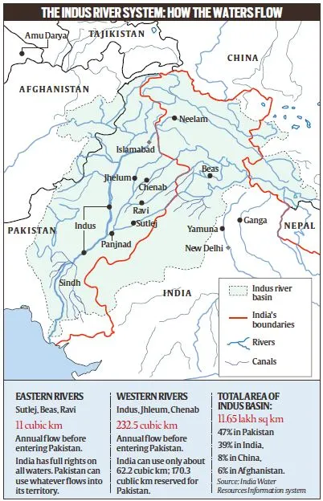
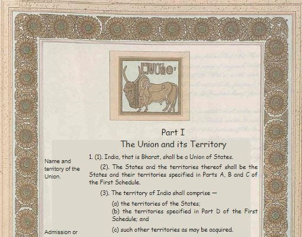
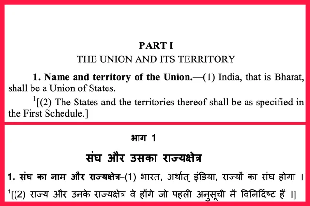
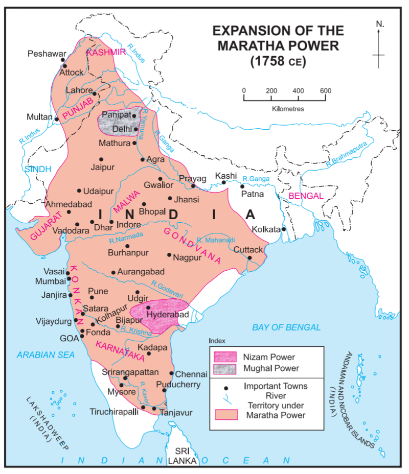
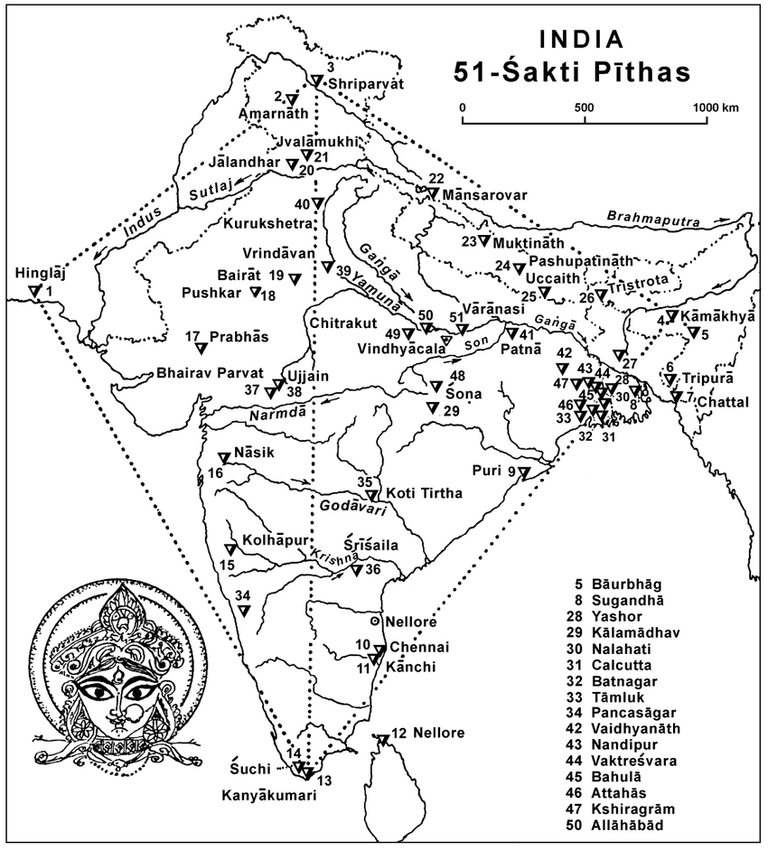
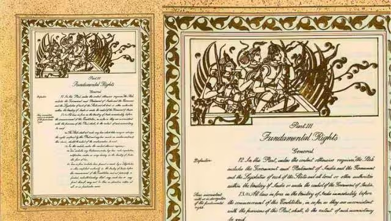
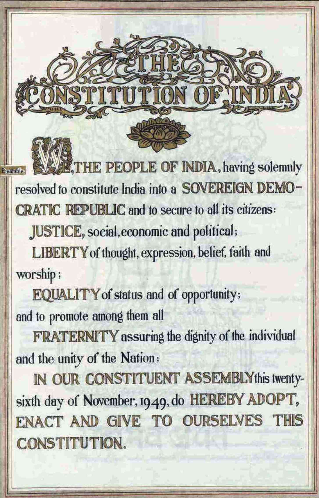

---
> Who are you?

When you are asked this question, what will you answer? Perhaps you will tell
me your name? Maybe you will tell them about your family, your birthplace, your
parents, etc. Pretty easy right? Now answer this question:

> Where are you from?

What do you think? India? Why?

Let's try to list down possible explanations :

1) Perhaps you were born in India?

2) Maybe your ancestors were born in India?

But is that enough? By that logic, all presidents of India up until
Smt. Droupadi Murmu, and all prime ministers of India up until Shri Narendra
Damodardas Modi was not Indian. As neither they were born in India (est. 1947 CE),
let alone their parents. But all of them were as much Indian or Bhartiya as you
and me. So, what makes you, me, and all these people born before 1947 Indian?

I will be very specific here: Having Indian Citizenship does not constitute one being "from India".

A person born in India who acquired US citizenship will always be a US Citizen
originally *from*   India. To take India out of their system in their lifetime
will be impossible in most cases. Their subsequent generations can drop India
from their identity, which is perfectly fine.

## What is India, that is Bharat?

So, let's come back to the primitive question of what is India. To successfully
answer that, we need to understand what is a nation / what is a country first.

Try defining a country in your mind. Is it just land? Is it just some 3rd
country (read Britain) drawing a closed shape on a map? Is it just a worthless identity
a lot of people associate them with? Is it just all people practicing a common language?
Is it people speaking a common language?

It's none of them. All great nations have nothing of these in common. Often the
countries that define themselves based on this logic do not end up doing well. Take our
beloved Pakistan as an example. What is Pakistan? It is a country created for followers of Islam.
What else? Nothing. Take examples of African countries: Random Europeans drew lines between them.
For example, Guinea, is a country which requires a further question - which Guinea?  
There are 5 countries with Guinea in their name. They all are different countries
but keep a common term Guinea in their name. Why?

### Identity and civilisation

You in some random moment of your life thought, Where does the term "India" or "Hindustan" come from?
A common working response is, that it comes from the Indus River. But don't you think Indus also sounds like an
English / Latin name.

Let's take a walk around what happened in the past. It all begins from a piece of land east of the
river Sindhu (now known as Indus).

This Sindhu River is very important for us. This gives rise to the Indus Valley Civilisation.
Regions were named after it, Sindh, Punjab (erstwhile Saptasindhu - seven rivers including Indus and Saraswati).
The people of Sindh are called Sindhis. Sindhu starts near the holy Mt. Kailash and flows through Tibet, India, and then to Pakistan.

The Indus Valley Civilisation, also known as the Harappan Civilisation, thrived from around
3300 BCE to 1300 BCE. Its heartland was situated in the fertile plains along the Indus River,
where sophisticated urban centers like Harappa and Mohenjo-daro emerged. These cities had
advanced urban planning, a system of writing, and a complex social and economic structure.

The civilization had extensive trade networks, and its artifacts suggest connections with
Mesopotamia, Central Asia, and other neighboring regions. The people of the Indus Valley
engaged in agriculture had a system of standardized weights and measures and built
advanced drainage and sanitation systems.

To trade, people from Central Asia and Mesopotamia had to travel to the east, cross the Sindhu River,
and they would reach a place where Brahma, Vishnu, and Shiva were worshipped. They would reach a place
where goddess Laxmi, Saraswati, and Parvati are celebrated and worshipped. A land where the primary
identity of one comes from their mother - Devakinandan, Kaushalyanandan, and Anjaneya is how Lord Shri Krishna,
Lord Shri Ramchandra and Lord Shri Hanuman are identified.

The initial contact with people living eastwards of the Sindhu River was made by Persians.
Iran, erstwhile Persia was an affluent society. It has a glorious past and a lot of history
but let's not go there. The initial "S" is a relatively rare sound in old Persian (Parsi). Around
850–600 BCE the older “S”. changed into “H”. Which meant, `sapta` (7 - a Sanskrit word)
becomes `hafta` and `Sindhu` becomes `Hindu`.

This is how `Hindu` came into being. All people living in the piece of land between Brahmaputra
and Sindu rivers were termed as Hindus. The term "Hindu" has no relevance or occurrence in any of the
holy/ancient texts we sanatanis had. Later the Greeks came along with a Cockney accent
and pronounced “Hindu” as “Ind(os)”, which is why the English word for India has neither
the “H” of Persian nor the “S” of Sanskrit.

This is how we become India and Indians. This is how we become Hindustan and Hindus.

Let's try to define the latter term, "Bharat" that I used in the section heading.

### What is Bharat?

Let me start by showing a section of the Constitution of India:

Now compare what the Hindi version of the Constitution says versus what the English version says:

The name "Bharat", can be traced back to whatever time you want to. One of the most important events that
happened in Indian history was the battle of Kauravs and Pandavas, the book that tells us about, called
Mahabharata is named after a Chandravanshi, who became a chakravartin (One that rules over the whole land) King Bharata.
He is said to be the ancestor of Kauravas and Pandavas.

Rigveda's Mandala 7 Shloka 18 mentions a battle of 10 kings where King Bharat from the Bharat tribe won
and created a common identity throughout the land.

In Jainism, Bharata was the first chakravartin (lit. 'holder of a chakra', i.e., emperor)
of Avasarpini (present half-time cycle). He was the eldest son of Rishabhanatha, the first Tirthankara.

Chanakya mentions Bharatvarsha multiple times in his texts. India had plenty of kings claiming to be
Chakravartin, which means they had "ekchatra" rule over the land.

The information of the monarchs is given by Mahabharata. When the Rajasuya Yagya was conducted by Yudhishthira,
Rishi Vaishampayana described to him a list of 16 Samrats who had lived before the Mahabharata era.
The list occurs in Mahabharata (12.29) -small plug as I am reading Mahabharata-  and is called Shodasha Rajika or a list of 16 kings.
They are- ( Brackets contain the lineage and kingdom they belong to)

- Marutta Avikshita ( Suryavanshi and Vaishali kingdom)
- Suhotra Atithina    ( Chandravanshi, Puru (Bharatvansh) and Kurujangala kingdom)
- Brihadratha Anga  ( Chandravanshi and Anga kingdom)
- Shivi Aushinara     ( Chandravanshi, Anu and Shivi kingdom)
- Bharata Daushyanti ( Chandravanshi, Puru and Kurujangala kingdom)
- Ram Dasharathi     ( Suryavanshi and Ayodhya or Kosala kingdom)
- Bhagiratha Dileepa (Suryavanshi and Ayodhya or Kosala kingdom)
- Dileepa Khatvanga ( Suryavanshi and Ayodhya or Kosala kingdom)
- Mandhata Yauvanashva ( Suryavanshi and Ayodhya or Kosala kingdom)
- Yayati Nahusha      ( Chandravanshi and ruled Puru+Anu+Yadava+Turvasu+Druhyu kingdom)
- Ambarisha Nabhagi  ( Suryavanshi and Ayodhya or Kosala kingdom)
- Shashabindu Chaitrarathi ( Chandravanshi, Yadava and Yadava kingdom)
- Gaya Amurtarayas  ( Chandravanshi and Kanyakubja kingdom)
- Rantideva Sankruti  ( Chandravanshi and Charmanvati (Chambal) kingdom)
- Sagara Aikshvaku   ( Suryavanshi and Ayodhya or Kosala kingdom)
- Prithu Vainya          ( Older than the formation of Suryavansha and Chandravansha)

And to add to this list, we have Yudhishthira Pandava, again a Chandravanshi Puru and Kurujangala kingdom.
Harivansha (1.13.25) mentions king Harishchandra of Ayodhya as a Samrat.

After Mahabharata, we had popular kings such as Ashoka, Chandragupta, Shivaji, etc.
However, I don't have a concrete list as there is no literature I could find. Still,
history has plenty of mentions of [ashvamedha yagna](https://en.wikipedia.org/wiki/Ashvamedha)
which tells us, that the land always had something in common which all these rulers wanted to rule on.

When Shivaji created a revolution which led up to this day, he did it because he could
not tolerate his motherland being ruled by foreigners. He wanted "Swarajya" - now think,
if there was no concept of a nation before the British came, then why did Shivaji envision
a self-governed state without foreign interference which is exactly what India is today?
And I think as a civilization we have forgotten the roots from which we hail. This is
okay because let's not forget we had no independence for at least the last 800 years after
Qutb al-Din Aibak sat on the throne of Delhi after Ghori defeated Prithviraj Chouhan.

We briefly reclaimed it with Maratha's ruling over large parts of India. See the map below,
don't you see a shadow of how modern-day India looks like? Sadly we lost it quickly again as
British came along.

It is after 800ish years, in 1947 CE, that Indians had gained the control of India back
from the atyacharis and invaders.

## The last civilization alive

Bharat is the last major civilization to be alive in the modern world. Every major old
civilization has perished through time.

We have a concept of Yugas. The four Hindu Yugas are the Satya (or Krita) Yuga,
the Treta Yuga, the Dwapara Yuga, and the Kali Yuga. Each Yuga represents a degradation
in human spiritual life, followed by a period of renewal and a new Satya Yuga. After Mahabharata,
we went to Kaliyuga. In Kaliyuga, people are at their worst - which to my surprise is very evident.

Kaliyuga brought about the decline of all major civilizations. We have riots everywhere in the world.
A secular Britain, France, and the United States. No one is living peacefully - we have 4 nations at war as
we speak and tensions in Pakistan and Iran are at their peak.

The feeling of swarajya and bharatvarsha in the minds of Chanakya and Shivaji is what has kept us alive.
We may have different languages, ways of practicing religion, colors, and food. One thing that keeps us together
is the culture. Civilisationally, we have common roots. Lord Hanuman was born in present-day Karnataka,
and he was a devotee of Shri Ramchandra who was a prince of present-day Uttar Pradesh.

We have never perished due to outsiders, but because of the outsiders being able to spark a
conflict in the insiders. We need to be united to sustain, we need to be "one" to live the next one thousand years.

### 51 Shaktipeethas

### 12 Jyotirlingas

Do you see the geographic distribution here? This is what has kept us as is. The common identity,
from north to south, from east to west. Politically we were ruled by the same king for long periods and religiously, we were always the same. For the past 800 or so years, this civilization was lost. We were
told we were primitive. We were told our language was of no use. We were told we don't wear good clothes.
We were told our education system was useless. We were told the medical science we developed was useless.
We were canceled left right and center - because that is how you win over a tightly bound civilization.
By creating divided identities inside a unified country, and by making the people hate their way of
life.

And they succeeded - Mostly. We speak English - which is fine!, what is not fine is ridiculing someone
who does not. English is the status symbol. They have instilled a hate for our language in our brains.
If someone speaks poor English - we quickly attribute them to being less educated. Heck, even I used
to do that at a younger age. I see small kids conversing in English in their day-to-day lives. I have friends
who can not read Devanagari. They have to convert dwadash or barah to twelve to understand what it is.

The day I wear a dhoti, I get looks like I am an alien from people around me in my own country. But wearing
jeans is perfectly fine. This boils my blood. Although I used to be an atheist, these days, I am not
sure what I am. I have always been very unapologetic in being a sanatani who is living east of Sindhu and west of Brahmaputra.

Mind you, India was always a plural society. Chandragupta married a Greek princess Helena. Islam came to India
and flourished. Buddhism and Jainism flourished. Persians, persecuted in their own land came to India and flourished.
Jews came to India when they had nowhere else to go and flourished. We accept everyone. We welcome everyone.

Our civilization is all about being plural. Civilization is lost when we lose the ability to be plural.
When we lose the ability to welcome everyone. The Hindu in us makes us do that. That Hindu is inside the Buddhist,
the Jain, the Muslim, and everyone who has the same ancestors as me. The Hindu means one who lives east of the Sindhu River.
What has happened in Iran (erstwhile Persia), Pakistan, Afghanistan, Bangladesh, and Middle Eastern countries is self-evident.
These countries have lost the ability to be plural. Riots in France show us what is happening in western developed
world too.

Sadly, civilization was lost by 1947 when we got independence. We forgot who we were. Where we came from.
20 generations saw a Babri Masjid in place of where their Lord Ramchandra was born, the holiest site for a majority of them.

Two ways of breaking a civilization are:

1) Break their knowledge system

2) Break their faith

## Recovery of a lost civilization

Recovery of the civilization began in 1947 with our constitution having this in it :

Recently I saw a whole load of people posting the Preamble of the Constitution on the day of Pran Pratishtha. This is how the
The preamble was drafted by the committee headed by Dr. Ambedkar.

Now please do one exercise, and compare it to what it is today. What is today is the result of the constitution being amended
in the darkest era of Independent India - during the emergency.

When we got partitioned, we lost the Ma Sharda Shaktipeetha to Pakistan in the PoK. It is in ruins these days. Rumors are its
[getting converted to a coffee house](https://www.republicworld.com/world-news/pakistan/pakistan-destroying-ancient-hindu-temple-sharda-peeth-in-pok-to-build-coffee-house/). All this is done to destroy the fabric on which the civilization was built on.

What do you have to explain to Kashmiri Pandits, who got thrown away from their own land, in their own country
about 33 years back and worship Ma Sharda? What makes you believe this can not happen to you? Also, why are we
as a country not ashamed that we can settle 13700 Rohingya refugees in Kashmir but not even one Kashmiri Pandit who
belonged from there? Another important note is, that settling refugees is not wrong, denying settlement of original inhabitants
is wrong. Descendents of Rishi Kashyap, whose name Kashmir is called Kashmir, do not live there anymore. It's a shame.

In my [last blog](https://thoughts.shreyasb.com/truth/) I mentioned blasphemy laws, and there I gave multiple examples which show it can
happen to you, me, and anyone. We have to make sure it does not happen to not just us, but to our upcoming generations.

We have to ensure we are independent, we are not enslaved by the West - neither economically nor educationally. We have to maintain peace.
We have to ensure we instill confidence in the youth of the country. They start with knowing they are from a great country.
Confidence plays a HUGE role. All of this is possible if we remain a plural country. We have to reclaim our civilization.

Next coming generations will see a Ram temple in Ayodhya, and also a [HUGE mosque in Ayodhya](https://www.hindustantimes.com/india-news/muslim-body-reveals-date-for-ayodhya-mosque-construction-new-crowdfunding-plan-101705900427004.html). They will witness a country
which is developed and affluent. We have been pulling record people out of extreme poverty and poverty in the last few years, we need to keep up with that.

We have to ensure no one is homeless, and everyone can afford food. We don't need to be absolute capitalists like the US and absolute communists like what Mao and Lenin envisioned. We need to be somewhere in between. We need to make sure all citizens have the same civil laws. I am tempted to add a clip by Shri Atal Bihari Vajpayee.

<iframe width="560" height="315" src="https://www.youtube.com/embed/w0MM_fqvW6E?si=VsdJC8ZSnGfFfnUQ" title="YouTube video player" frameborder="0" allow="accelerometer; autoplay; clipboard-write; encrypted-media; gyroscope; picture-in-picture; web-share" allowfullscreen></iframe>

We will rise, again!
