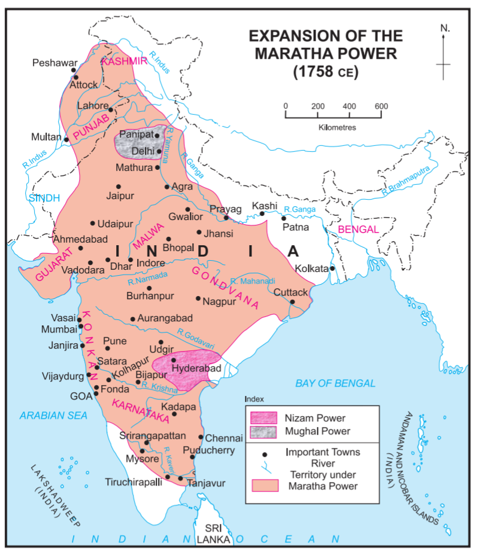
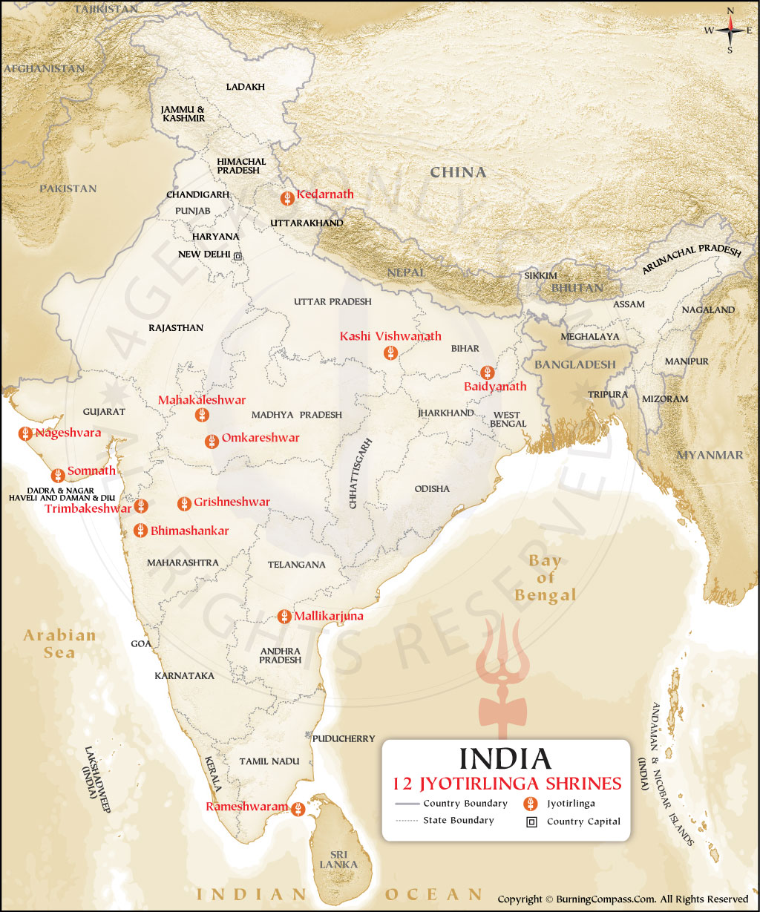

> Who are you?

When you are asked this question, what will you answer? Perhaps you will tell
your name? Maybe you will tell them about your family, your birthplace, your
parents etc. Pretty easy right? Now answer this question:

> Where are you from?

What do you tell? India? Why?

Let's try to list down possible explanations :

1) Perhaps you were born in India?

2) Maybe your ancestors were born in India?

But is that enough? Since by that logic, all presidents of India up until
Smt. Droupadi Murmu, and all prime ministers of India up until Shri Narendra
Damodardas Modi were not Indian. As neither they were born in India (est. 1947 CE),
let alone their parents. But all of them were as much Indian or Bhartiya as you
and me. So, what makes you, me and all these people born before 1947 Indian?

I will be very specific here: Having an Indian Citizenship does not constitute one being "from India".

A person born in India who acquired US citizenship, will always be a US Citizen
originally *from*   India. To take India out of their system in their lifetime
will be impossible in most cases. Their subsequent generations can drop India
from their identity, which is perfectly fine.

## What is India, that is Bharat?

So, lets come back to the primitive question of what is India? To successfully
answer that, we need to understand what is a nation / what is a country first.

Try defining a country in your mind. Is it just land? Is it just some 3rd
country (read Britain) drawing a closed shape on a map? Is it just a worthless identity
a lot of people associate them with? Is it just all people practicing a common language?
Is it people speaking common language?

It's actually none of them. All great nations have nothing of these in common. And often the
countries who define themselves based on these logics are do not end up doing well. Take our
beloved Pakistan as an example. What is Pakistan? It is a country created for followers of Islam.
What else? Nothing. Take examples of African countries : Random Europeans drew lines between them.
For example, Guinea, a country which requires a further question - which Guinea?  
As there are 5 countries with Guinea in their name. They all are different countries
but keep a common term Guinea in their name. Why?

### Identity and civilisation

You in some random moment of your life thought, Where does the term "India" or "Hindustan" come from?
A common working response is, it comes from Indus River. But don't you think Indus also sounds like an
English / Latin name.

Let's take a walk around what happened in the past. It all begins from a piece of land east of the
river Sindhu (now known as Indus).

This Sindhu river is very important for us. This gives rise to the Indus Valley Civilisation.
A whole region was named after it, Sindh. The people of Sindh are called Sindhis. Sindhu starts
near holy Mt. Kailash and flows through Tibet, India and then to Pakistan.

The Indus Valley Civilisation, also known as the Harappan Civilisation, thrived from around
3300 BCE to 1300 BCE. Its heartland was situated in the fertile plains along the Indus River,
where sophisticated urban centres like Harappa and Mohenjo-daro emerged. These cities had
advanced urban planning, a system of writing, and a complex social and economic structure.

The civilisation had extensive trade networks, and its artifacts suggest connections with
Mesopotamia, Central Asia, and other neighbouring regions. The people of the Indus Valley
engaged in agriculture, had a system of standardised weights and measures, and built
advanced drainage and sanitation systems.

To trade, people from Central Asia and Mesopotamia had to travel to the east, cross Sindhu river,
and they would reach a place where Brahma, Vishnu and Shiva were worshipped. They would reach a place
where goddess Laxmi, Saraswati and Parvati are celebrated and worshipped. A land where the primary
identity of one comes from their mother - Devakinandan, Kaushalyanandan, and Anjaneya is how Lord Shri Krishna,
Lord Shri Ramchandra, and Lord Shri Hanuman are identified.

Since the initial contacts with people living eastwards of Sindhu river was made by Persians.
Iran, erstwhile Persia was an affluent society. It has a glorius past and a lots of history
but lets not go there. The initial "S" is a relatively rare sound in old Persian (Parsi). Around
850–600 BCE the older “S”. changed into “H”. Which meant, `sapta` (7 - a sanskrit word)
becomes `hafta` and `sindu` becomes `hindu`.

This is how Hindu came into being. All people living in the piece of land between Brahmaputra
and Sindu river were termed as Hindus. The term "hindu" has not relevance or occurance in any of the
holy/ancient texts we sanatani's had. Later the Greeks came along with a Cockney accent
and pronounced “Hindu” as “Ind(os)”, which is why the English word for India has neither
the “H” of Persian nor the “S” of Sanskrit.

This is how we become India, and Indians. This is how we become Hindustan, and Hindus.

Let's try to define the latter term, "Bharat" that I used in the section heading.

### What is Bharat?

Let me start by showing a section of the Constitution of India:

Now compare what Hindi version of Constitution says versus what English version says:

The name "Bharat", can be traced back to whatever time you want to. One of the most important events that
happened in Indian history was the battle of Kauravs and Pandavas, the book which tells us about is called
Mahabharata named after a chandravanshi, who became a chakravartim (One that rules over the whole land) King Bharata.
He is said to be the ancestor of Kauravas and Pandavas.

Rigveda's Mandala 7 shloka 18 mentions a battle of 10 kings where King Bharat from Bharat tribe won
and created a common identity throughout the land.

In Jainism, Bharata was the first chakravartin (lit. 'holder of a chakra', i.e., emperor)
of Avasarpini (present half-time cycle). He was the eldest son of Rishabhanatha, the first tirthankara.

Chanakya mentions bharatvarsha multiple times in his texts. India had a plenty of kings claiming to be
Chakravartin, which means they had "ekchatra" rule over the land.

The information of the monarchs is given by Mahabharata. When the Rajasuya Yagya was conducted by Yudhishthira,
rishi Vaishampayana described to him a list of 16 Samrats who had lived before the Mahabharata era.
The list occurs in Mahabharata (12.29) -small plug as I am reading Mahabharata-  and is called Shodasha Rajika or a list of 16 kings.
They are- ( Brackets contain the lineage and kingdom they belong to)

- Marutta Avikshita ( Suryavanshi and Vaishali kingdom)
- Suhotra Atithina    ( Chandravanshi, Puru (Bharatvansh) and Kurujangala kingdom)
- Brihadratha Anga  ( Chandravanshi and Anga kingdom)
- Shivi Aushinara     ( Chandravanshi, Anu and Shivi kingdom)
- Bharata Daushyanti ( Chandravanshi, Puru and Kurujangala kingdom)
- Ram Dasharathi     ( Suryavanshi and Ayodhya or Kosala kingdom)
- Bhagiratha Dileepa (Suryavanshi and Ayodhya or Kosala kingdom)
- Dileepa Khatvanga ( Suryavanshi and Ayodhya or Kosala kingdom)
- Mandhata Yauvanashva ( Suryavanshi and Ayodhya or Kosala kingdom)
- Yayati Nahusha      ( Chandravanshi and ruled Puru+Anu+Yadava+Turvasu+Druhyu kingdom)
- Ambarisha Nabhagi  ( Suryavanshi and Ayodhya or Kosala kingdom)
- Shashabindu Chaitrarathi ( Chandravanshi, Yadava and Yadava kingdom)
- Gaya Amurtarayas  ( Chandravanshi and Kanyakubja kingdom)
- Rantideva Sankruti  ( Chandravanshi and Charmanvati (Chambal) kingdom)
- Sagara Aikshvaku   ( Suryavanshi and Ayodhya or Kosala kingdom)
- Prithu Vainya          ( Older than the formation of Suryavansha and Chandravansha)

And to add to this list, we have Yudhishthira Pandava, again a Chandravanshi Puru and Kurujangala kingdom.
Harivansha (1.13.25) mentions king Harishchandra of Ayodhya as a Samrat.

After Mahabharata, we had popular kings such as Ashoka, Chandragupta, Shivaji etc.
Although I don't have a concrete list as there is no literature I could find. Still,
history has a plenty mentions [ashvamedha yagna](https://en.wikipedia.org/wiki/Ashvamedha)
which tells us, the land always had something in common which all these rulers wanted to rule on.

When Shivaji created a revolution which led upto this day, he did it because he could
not tolerate his motherland being ruled by foreigners. He wanted "Swarajya" - now think,
if there was no concept of a nation before british came, then why did Shivaji envision
a self governed state without foreign interference which is exactly what India is today.
And I think as a civilisation we have forgotten the roots from where we hail. Which is
okay, because let's not forget we had no independence for at least last 800 years after
Qutb al-Din Aibak sat in the throne of Delhi after Ghori defeated Prithviraj Chouhan.

We briefly reclaimed it with Maratha's ruling over large parts of India. See the map below,
don't you see a shadow of how modern day India looks like? Sadly we lost it quickly again as
British came along.

It is after 800ish years, in 1947 CE, that Indians had gained the control of India back
from the atyacharis and invaders.

## The last civilisation alive

Bharat is the last major civilisation to be alive in the modern world. Every major old
civilisation has perished through time.

We have a concept of Yugas. The four Hindu Yugas are the Satya (or Krita) Yuga,
the Treta Yuga, the Dwapara Yuga, and the Kali Yuga. Each Yuga represents a degradation
in human spiritual life, followed by a period of renewal and a new Satya Yuga. After mahabharata,
we went into Kaliyuga. In kaliyuga, people are at their worst - which to my surprise is very evident.

Kaliyuga brought about decline of all major civilisations. We have riots everywhere in the world.
A secular Britain, France and United States. No one is living peacefully - we have 4 nations at war as
we speak and tensions in Pakistan and Iran are at its peak.

The feeling of swarajya and bharatvarsha in the minds of Chanakya and Shivaji is what has kept us alive.
We may have different languages, ways of practising religion, colours, food. One thing that keeps us together
is the culture. Civilisationally, we have common roots. Lord Hanuman was born in present day Karnataka,
who was a devotee of Shri Ramchandra who was a prince of present day Uttar Pradesh.

### 51 Shaktipeethas

### 12 Jyotirlingas

This is what has kept us as is. The common identity, from north to south, from east to west.
Politically we were ruled by the same king for long periods of time and religiously, we were
always same. For past 800 or so years, this civilisation was lost. We were told we are primitive.
We were told our language was of no use. We were told we don't wear good clothes. We were told our
education system was useless. We were told the medical science we developed was useless. We were
cancelled left right and centre - because that is how you win over a tightly bound civilisation.
By creating divided identities inside a unified country, and by making the people hate their way of
life.

And they succeeded - Mostly. We speak english - which is fine!, what is not fine is ridiculing someone
who does not. English is the status symbol. They have instilled a hate for our own language in our brains.
If someone speaks poor english - we quickly attribute them with being less educated. Heck, even I used
to do that at my young age. I see small kids conversing in English in their day to day life. I have friends
who can not read devanagari. They have to convert dwadash or barah to twelve to understand what it is.

The day I wear a dhoti, I get looks like I am an alien from people around me in my own country. But me wearing
a jeans is perfectly fine.

## Recovery of lost civilisation

